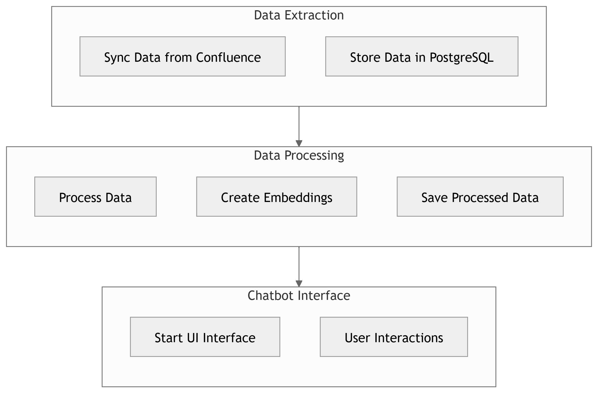

### 1. Data Extraction
**Objective**: Sync your Confluence data into a suitable database.

- **Tool**: Airbyte
- **Setup**: Install and configure Airbyte to connect to your Confluence instance.
- **Sync**: Use Airbyte to transfer data from Confluence to a PostgreSQL database. This involves setting up a source (Confluence) and a destination (PostgreSQL) in Airbyte.

### 2. Data Processing
**Objective**: Split documents into text snippets and create embeddings.

- **Tool**: Langchain
  - **ConfluenceLoader**: Use this to load documents from your PostgreSQL database.
  - **TextSplitter**: Split the documents into manageable text snippets.
  - **TokenSplitter**: Further split the text snippets into tokens if needed.
  - **Embeddings**: Use a model like OpenAI's ada-v2 to create embeddings for each text snippet. This converts the text into a numerical format that can be used for similarity searches.

### 3. Query Processing
**Objective**: Process user queries and find relevant text snippets.

- **Tool**: Langchain's RetrievalQA and ChromaDB
  - **User Query**: When a user submits a question, convert it into an embedding using the same model used for the text snippets.
  - **Retrieval**: Use ChromaDB to find the most relevant text snippets based on the similarity of their embeddings to the query embedding.
  - **Response**: Generate a response based on the retrieved text snippets.

### 4. Chatbot Interface
**Objective**: Create a user-friendly interface for the chatbot.

- **Tool**: Streamlit
  - **Setup**: Install and configure Streamlit.
  - **Interface**: Design a simple and intuitive interface where users can input their queries and receive responses.
  - **Integration**: Connect the Streamlit interface to your Langchain agent to handle user interactions and display responses.
 
### Diagram

1. Run `data_extraction.py`: This will sync data from Confluence to PostgreSQL.
2. Run `data_processing.py`: This will process the data, create embeddings, and save them.
3. Run `chatbot_interface.py`: This will start the Streamlit interface for user interactions.

You can run them independently and schedule them as needed. For example, you might run the data extraction and processing programs periodically to keep your data up-to-date, while the chatbot interface runs continuously to handle user queries
